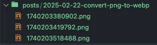
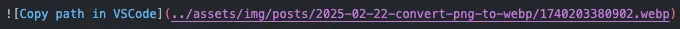
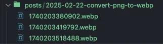
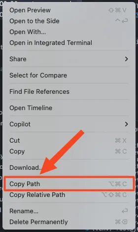

I am using [Shottr](https://shottr.cc/) for screenshots and I have set it up so screenshots are copied directly to the clipboard to allow me to paste them where I need them. The problem I ran into is that the screenshot files are in PNG format, but for documentation, I would prefer them to be in [WebP](https://en.wikipedia.org/wiki/WebP) to save some storage space. While there are lots of converters out there, none of them seemed to do what I needed: convert all the PNG files into WebP automatically without having to save them and convert them before using in the MD files. So the easiest solution I came up with is a Python script that scans a markdown file or a directory of markdown files for image references (``), converts them from PNG to WebP, and replaces the references in the markdown files with the converted files.

Before:

 \


After:

 \


## Getting started

Clone the repository.

```shell
git clone https://github.com/z0gst/md-img-converter.git
cd md-img-converter
```

Install `python3-venv` if required.

```shell
apt install -y python3-venv
```

Set up a [Python virtual environment](https://docs.python.org/3/library/venv.html).

```shell
python3 -m venv venv
```

Activate the virtual environment.

```shell
source venv/bin/activate
```

Install the requirements for the script.

```shell
pip install -r requirements.txt
```

## Using the script

> When using the script to convert images for Jekyll post, run the script **after** completing the post and **before** committing and pushing the changes to GitHub.
{: .prompt-tip }

> Set up `Markdown › Copy Files: Destination` to use a unique filename to avoid filename conflicts when running the script again after adding additional images to the file. For example, using just `${fileName}` will create another `filename.png` after the first one was converted to `filename.webp`, causing an overwritten image file on a second script run.
{: .prompt-warning }

Once the requirements are installed and the Python virtual environment is active, just run the script.

```shell
python3 converter.py
```

Paste in either a markdown file path or the directory path for multiple markdown files. The easiest way to get the path is to right-click on the file or directory in VS Code and select Copy Path.



The script will scan all the PNG image references in the given markdown file(s) and replace them with WebP links after converting the images.

## Deactivate the virtual environment

```shell
deactivate
```
