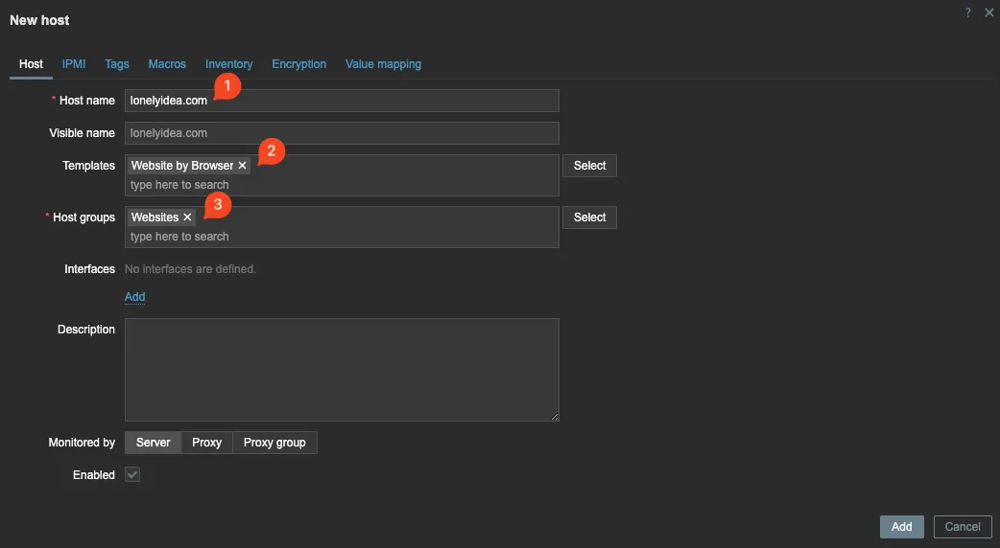
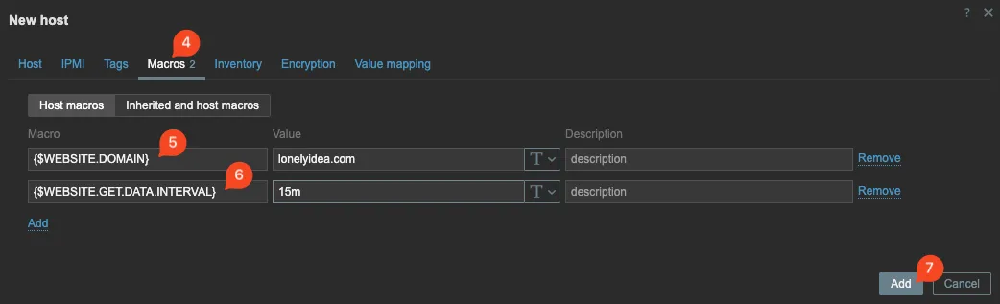
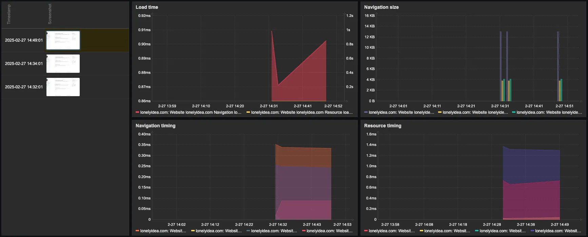

## Requirements

Minimum required Zabbix version is `7.0.0`, however the instructions here were tested on version `7.2.3` installed with Docker containers ([zabbix-server-pgsql](https://hub.docker.com/r/zabbix/zabbix-server-pgsql)).

## Install WebDriver

[Selenium standalone-chrome @ Docker Hub](https://hub.docker.com/r/selenium/standalone-chrome)

Create a new docker compose file for Chrome. I'll be adding Chrome container to the same network as Zabbix server. This allows me to specify the WebDriver IP address for Zabbix server to use.

> As I will be using the WebDriver within the same docker network as the Zabbix server, I am not exposing any ports for the Chrome container. To expose the Chrome externally, ports `7900` and `4444` will need to be exposed.
{: .prompt-info }

> Be sure to use an IP in the range of existing network. For me, the zabbix network is `172.20.0.0/24`. All docker networks can be listed with `docker network ls` and the subnet of the network can be checked with `docker network inspect <network_name> | grep -i subnet`
{: .prompt-warning }

```yaml
services:
  chrome:
    image: selenium/standalone-chrome:latest
    container_name: chrome
    restart: unless-stopped
    shm_size: 2g
    networks:
      zabbix_zabbix:
        ipv4_address: 172.20.0.50

networks:
  zabbix_zabbix:
    external: true
```

Run the container:

```shell
docker compose up -d
```

## Configure Zabbix

There is two parts to getting Zabbix to monitor a website. Firstly Zabbix needs to know the address of the WebDriver, and secondly which website and how often to monitor.

### Update Zabbix server docker compose file

[Zabbix server @ Docker Hub](https://hub.docker.com/r/zabbix/zabbix-server-pgsql)

> Default amount of browser pollers are set to 1, this can be modified by adding a new environment variable `ZBX_STARTBROWSERPOLLERS` to the docker compose, specifying the amount required.
{: .prompt-tip }

```diff
...
environment:
+  ZBX_WEBDRIVERURL: "172.20.0.50:4444"
...
```

### Adding a website to monitor

In Zabbix frontend, navigate to `Data collection -> Hosts` and click on `Create host` on top right corner.

Fill in the following fields:

- `Host name`: lonelyidea.com
- `Templates`: Website by Browser
- `Host groups`: as needed (e.g. "Websites")



Navigate to Macros tab and add two new macros:

- **Macro**: `{$WEBSITE.DOMAIN}`
- **Value**: Website URL to monitor (e.g. lonelyidea.com)

And:

- **Macro**:`{$WEBSITE.GET.DATA.INTERVAL}`
- **Value**: Choose how often the website is checked (e.g. 5m or 1h)



Optional macros:

- `{$WEBSITE.PATH}`
- `{$WEBSITE.SCHEME}` - default `https`
- `{$WEBSITE.SCREEN.HEIGHT}` - default `1080`
- `{$WEBSITE.SCREEN.WIDTH}` - default `1920`

Click `Add` at the bottom right of the new host dialog window.

## Viewing the collected data

Navigate to `Monitoring -> Hosts` and select `Dashboards` for the newly created host.


